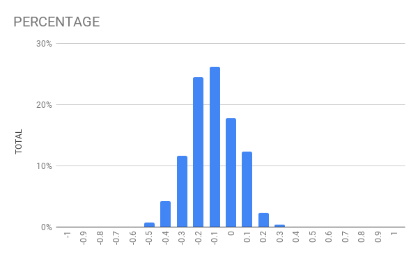

# Block game
Attempt a game made with the godot engine. 
It should initially be a minecraft clone, and maybe add cool stuff after?

## Controls:
```
WASD:        Move
MOUSE:       Look around 
E:           Toggle flying
Q/Esc:       Quit the game
LEFT MOUSE:  Remove block
RIGHT MOUSE: Add block
```

## Versions
Screenshots of versions by githash may be found [here](docs/versions.md)

## Noise distribution 

Distribution of values from `noise.get_noise_3d`, based on `774144` calls:


