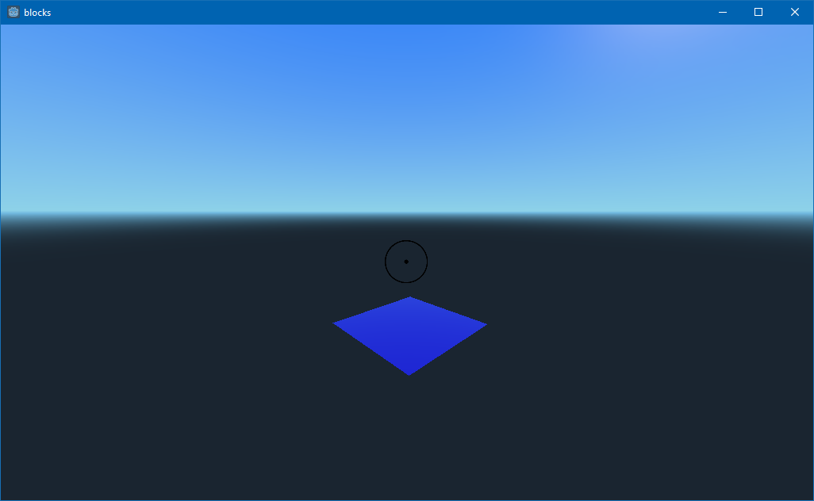

# Block game
Attempt a game made with the godot engine. 
It should initially be a minicraft clone, and maybe add cool stuff after?

## Versions
### dc0a51451bb734620bf8648742c002acd7487879

### 3aa6a67edb5d9ec3932759044aaac8a8f46307d4

### 44d742f5ff472aaab26d5e42b406963afafd1467

## Todo
 - Large chuck sizes crash the game, chucksize > 13 plummets fps 
 	- Maybe only have kubelets in memory, and render a plane of triangle representing everything exposed to air (everything that may be visible)
 - Moving into wall while jumping causes vertical collision, resetting vertical velocity back to 0
 - Change kubelet shape to d20 die (icosahedron)
 - Add textures to kubelets