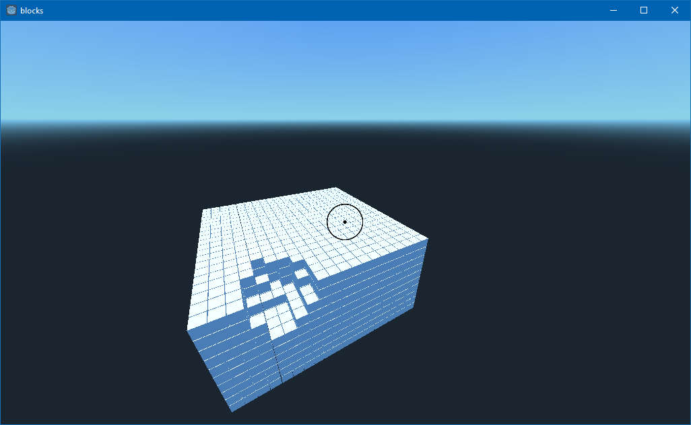

# Block game
Attempt a game made with the godot engine. 
It should initially be a minicraft clone, and maybe add cool stuff after?

## Versions
### dc0a51451bb734620bf8648742c002acd7487879

### 3aa6a67edb5d9ec3932759044aaac8a8f46307d4

## Todo
 - Change kubelet shape to d20 die (icosahedron)
 - Add gravity
 - Add textures to kubelets
